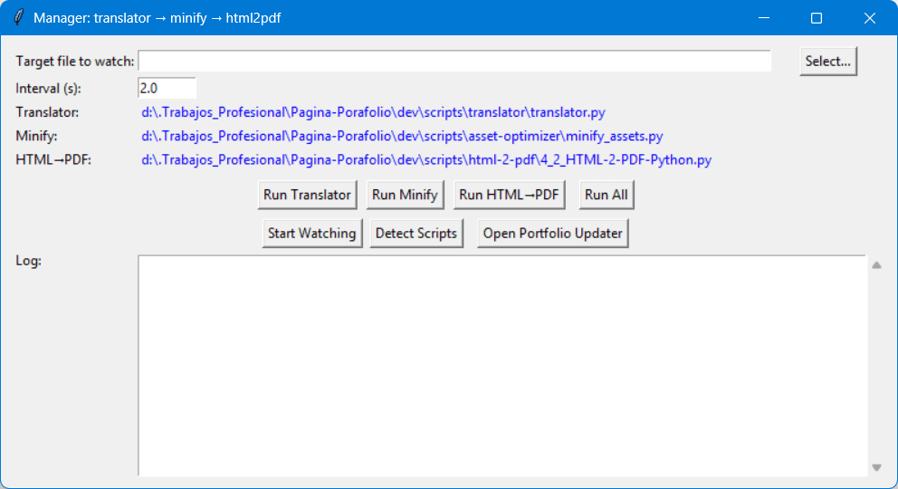

# ⚙️ Project Manager & Build Orchestrator

> **Un orquestador central que automatiza tu flujo de trabajo (CI/CD local) conectando la traducción, minificación y generación de PDFs en una sola cadena de comandos.**

El **Project Manager** es una herramienta híbrida (CLI + GUI) diseñada para vigilar los archivos base de tu proyecto (como `cv_data.js`). Al detectar un cambio, ejecuta automáticamente una "reacción en cadena" que actualiza todo tu ecosistema: primero traduce los textos, luego minifica los recursos y finalmente regenera los PDFs de exportación.



## ✨ Características Principales

- **👀 File Watcher Inteligente:** Monitoriza múltiples archivos en tiempo real usando hashes SHA-256 para detectar cambios precisos en el código.
- **🧠 Auto-Descubrimiento de Scripts:** No necesitas configurar rutas estáticas. El manager busca en tus carpetas de desarrollo y detecta automáticamente la versión más reciente de tus scripts basándose en el prefijo numérico más alto (ej. elige `9_script.py` por encima de `8_script.py`).
- **🖥️ Modo Híbrido (GUI & CLI):** Úsalo visualmente a través de su interfaz gráfica o intégralo en procesos automatizados de servidor mediante la terminal.
- **🧵 Multihilo (Threading):** Las salidas de consola de los sub-scripts se redirigen al panel de la GUI en tiempo real sin congelar la interfaz.
- **🛡️ Omitir Pasos Pesados:** Incluye flags como `--no-html` para saltarse la generación de PDFs cuando solo necesitas compilar código, ahorrando tiempo de CPU.

---

## ⚙️ Requisitos e Instalación

**Requisitos del sistema:**

- Python 3.8 o superior.
- Librerías estándar de Python (`hashlib`, `threading`, `tkinter`). No requiere instalaciones externas.

Asegúrate de que la estructura de carpetas mantenga la lógica base (el manager debe estar en `dev/manager/` y los scripts en `dev/scripts/`).

---

## 📖 Guía de Uso

### 1️⃣ Modo Interfaz Gráfica (Recomendado para escritorio)

Ejecuta el script sin argumentos para abrir la GUI:

```bash
python dev/manager/manager.py

    Select...: Elige uno o varios archivos a vigilar (ej. cv_data.js).

    Detect Scripts: Refresca y busca las últimas versiones de tus herramientas.

    Run All: Ejecuta la cadena completa manualmente una vez.

    Start Watching: Inicia la vigilancia en segundo plano. Guarda un cambio en tu editor de código y verás cómo el manager hace todo el trabajo.

2️⃣ Modo Terminal (Recomendado para automatización)

Puedes pasar los archivos objetivo y configuraciones directamente por consola.

Vigilar archivos en segundo plano (sin interfaz):
Bash

python dev/manager/manager.py js/cv_data.js js/projects-opti.js

Ejecutar una sola vez y salir (Pipeline CI):
Bash

python dev/manager/manager.py js/cv_data.js --once

Ejecutar todo EXCEPTO el generador de PDF:
Bash

python dev/manager/manager.py js/cv_data.js --once --no-html

💡 ¿Cómo funciona la Cadena de Construcción?

Cuando se detecta un cambio en un archivo objetivo, el manager ejecuta el siguiente flujo estricto:

    🌐 Traductor: (translator.py) Actualiza las versiones en inglés de los archivos modificados.

    ⚡ Minificador: (minify_assets.py) Comprime los nuevos JS/CSS resultantes.

    📄 Generador PDF: (HTML-2-PDF-Python.py) Lanza el navegador headless para tomar "capturas" del HTML actualizado y generar los PDFs finales (Omitible con --no-html).
```
